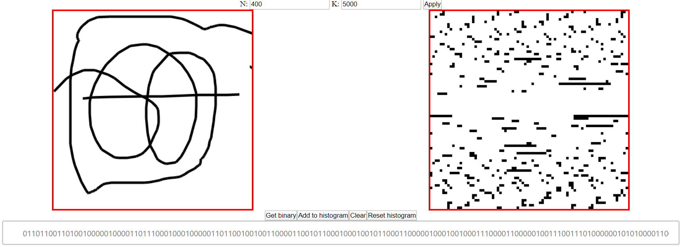
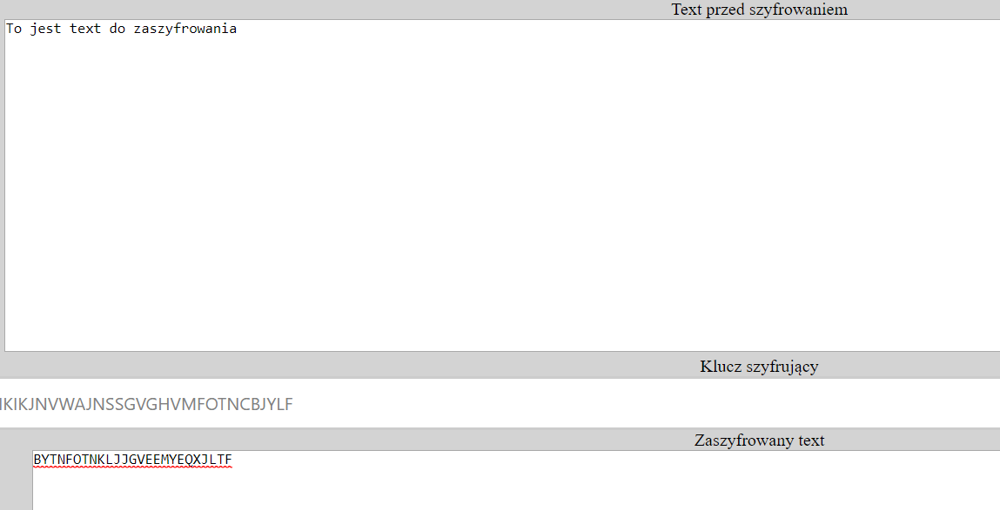
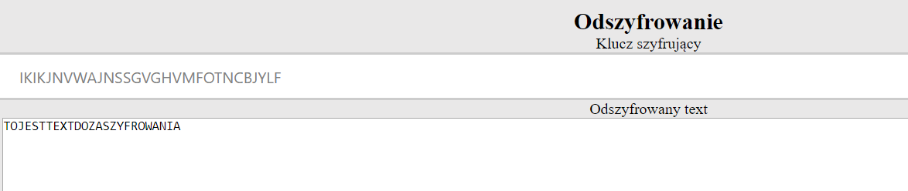

# TRNG-generator 

Aplikacja wykorzystująca algorytm opisany w pracy naukowej „A True Random Number Generator Based on Mouse Movement and Chaotic Cryptography” autorstwa Yue Hu. Program korzysta z ruchu myszki do generowania ciągów losowych, tworzy wykresy histogramu oraz oblicza entropię. Dodatkowo wykorzystuje szyfrowanie algorytmem Vinegere’a. Projekt napisany przy użyciu JavaScript, zrealizowany w ramach laboratoriów Bezpieczeństwa Systemów Teleinformatycznych.  

Ekran przedstawia pole pobierąjace ruch myszki użytkownika następnie zamieniajacy go w losowy zestaw punktów oraz ciąg liczbowy jemu odpowiadający. 

  

Dodana została także funkcjonalność za pomocą której możliwe jest zaszyfrowanie wiadomości przesłanej do aplikacji.  

 

Zaszyfowaną wiadomość mozna nastepnie odszyfrować. 

